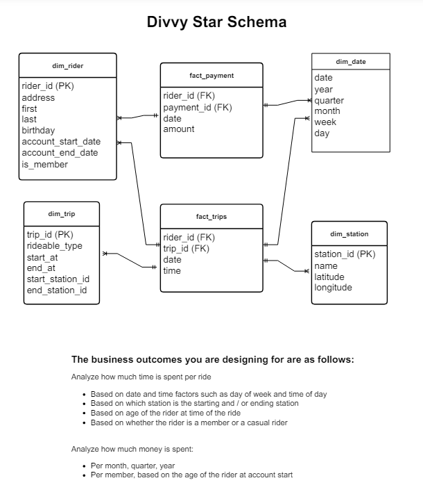
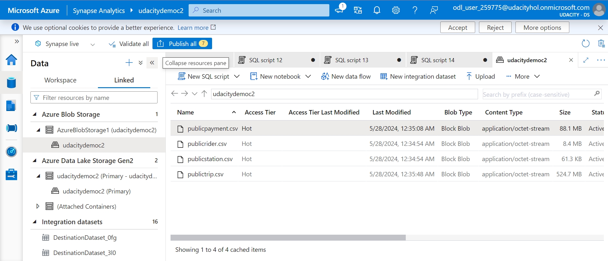
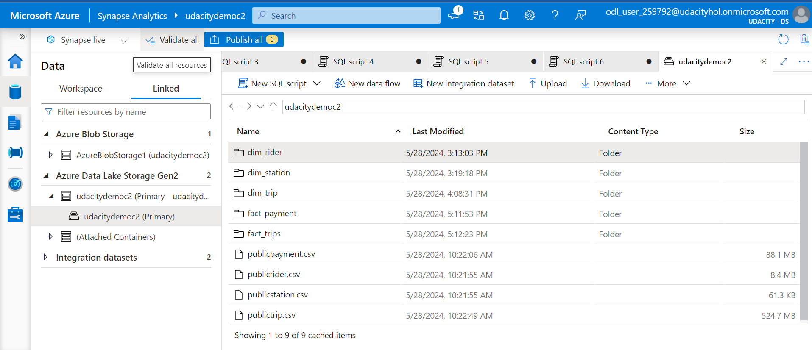

# Azure DataWareHouse Project

Divvy is a bike sharing program in Chicago, Illinois USA that allows riders to purchase a pass at a kiosk or use a mobile application to unlock a bike at stations around the city and use the bike for a specified amount of time. The bikes can be returned to the same station or to another station. The City of Chicago makes the anonymized bike trip data publicly available for projects like this where we can analyze the data.

Since the data from Divvy are anonymous, we have created fake rider and account profiles along with fake payment data to go along with the data from Divvy. The dataset looks like this:

### The business outcomes you are designing for are as follows:

#### Analyze how much time is spent per ride
* Based on date and time factors such as day of week and time of day
* Based on which station is the starting and / or ending station
* Based on age of the rider at time of the ride
* Based on whether the rider is a member or a casual rider

#### Analyze how much money is spent
* Per month, quarter, year
* Per member, based on the age of the rider at account start

#### EXTRA CREDIT - Analyze how much money is spent per member
* Based on how many rides the rider averages per month
* Based on how many minutes the rider spends on a bike per month

### The goal of this project is to develop a data warehouse solution using Azure Synapse Analytics.

* Design a star schema based on the business outcomes;

* Import the data into Synapse;

* Transform the data into the star schema;

and finally, view the reports from Analytics.

